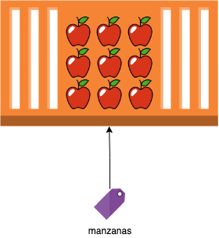

# Tipos, variables y conversiones

## ¿Que es una variable?

Es la forma en la cual los programadores guardan datos en la memoria del computador.

Podriamos hacer la siguiente analogía. Imaginemos que las variables son etiquetas para nuestros datos, entonces tenemos un contenedor de manzanas con una etiqueta que dice 'manzanas'. 



En este ejemplo, la variable 'manzanas', señala al contenedor de manzanas y cada vez que hagamos referencia a la variable manzanas, vamos a estar haciendo referencia al contenedor de manzanas.


Son declaradas usando **const**, **let** y **var**.

```js
const nombre = "Daniel";
const edad = 12;
```


## ¿Que es un tipo?

Es la naturaleza de una variable, indica el tipo de información y el comportamiento que puede tener la variable.

# Bibliografía
- https://yeisondaza.com/entendiendo-los-tipos-en-javascript